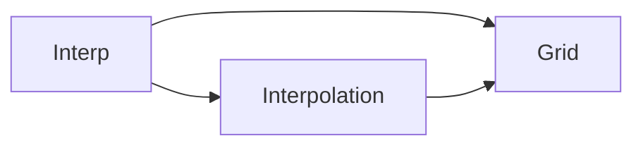

# 設計文書の書き方

各Iterationでは，実装の前に設計文書を更新し，実装の後に設計文書と実装を見比べる．
このガイドでは，3つの設計文書の役割，書き方，検査の方法をまとめる．
例には，このコースの題材とは別の小さなライブラリ`Interp`(1次元の線形補間)を使う．

## 設計の進め方

```text
テストリスト  →  設計文書  →  テストファーストの実装  →  設計レビュー
(振る舞い)       (構造と主張)                          (文書と実装の照合)
```

- テストリストは，外から見た**振る舞い**(この入力にはこの結果)を書く．
- 設計文書は，振る舞いを実現する**構造**(モジュールと依存)と，関数の**精度の主張**(誤差界)と，**判断の理由**を書く．
- 設計レビューでは，実装を終えた後に設計文書を読み直し，実装と食い違うところを直す．

## 3つの設計文書

| 文書 | ファイル | 示すこと |
| --- | --- | --- |
| モジュール依存図 | `design/modules.md` | `src/`のモジュールと，どのモジュールがどのモジュールを使うか |
| 誤差仕様書 | `design/error-spec.md` | 公開する関数ごとの条件数・誤差界・テストの許容誤差と根拠・検証するテスト |
| ADR | `design/adr/NNNN-<題名>.md` | アルゴリズムや方式を選んだ理由 |

### モジュール依存図

`src/`のモジュールを箱，`using`/`import`による依存を矢印で描く．
矢印`A --> B`は「AがBの関数を使う」を表す．
図はMermaidの`flowchart`で書き，`A --> B`(依存)と`A`(依存のないモジュール)の行だけを使う．

````markdown
# モジュール依存図

`Interp`を構成するモジュールと，その依存関係を示す．



- `Grid`は，格子点の列と，値を含む区間の探索を受け持つ．
- `Interpolation`は，区間の両端の値から補間した値を計算する．
````

図の下には，図で表せないこと(各モジュールの責任，標準ライブラリへの依存など)を箇条書きにする．

### 誤差仕様書

公開する関数ごとに1行を書く．
1列目は関数名(インラインコード)，最後の列は検証するテストファイルのパスである．

````markdown
補間の条件数をκ_I = (|1 − t||y₀| + |t||y₁|)/|y|とする(yは正しい補間値)．

| 関数 | 問題の条件数 | 誤差界 | テストの許容誤差と根拠 | 検証するテスト |
| --- | --- | --- | --- | --- |
| `linear_interpolate` | κ_I | 相対誤差 ≤ γ₃·κ_I | γ₃·κ_I(誤差界そのもの) | `test/unit/interpolation_tests.jl` |
| `find_interval` | なし(整数を返す) | 誤差なし | 0(`==`で比べる) | `test/unit/grid_tests.jl` |
````

- 「問題の条件数」には，入力の相対的な変化が出力にどれだけ拡大されるかを書く．整数を返す関数や無誤差の関数は「なし」と書く．
- 「誤差界」には，誤差解析で導いた上界を式で書く．記号(u，γₙ，κなど)は表の前に定義する．表のセルの中では`|`が列の区切りになるので，絶対値を含む式は表の前で定義して記号で参照する．
- 「テストの許容誤差と根拠」には，テストで使う値と，それを誤差界からどう導いたかを書く．
- 表の下には，前提(丸めの方式，オーバーフローしないことなど)と，許容誤差の導き方の詳細を書く．

### ADR(Architecture Decision Record)

方式を選んだら，その理由を1つの文書に残す．
ファイル名は`NNNN-<題名>.md`で，番号は1から順に増やす．

````markdown
# ADR 0001：補間式に(1 − t)y₀ + ty₁を使う

## 状況

線形補間の式には，y₀ + t(y₁ − y₀)と(1 − t)y₀ + ty₁の2つの形がある．
前者はt = 1でy₁を厳密に返すとは限らない．

## 決定

(1 − t)y₀ + ty₁を使う．

## 結果

- t = 0とt = 1で，端の値を厳密に返す．
- 乗算が1回増える．

## 検証

- t = 0とt = 1の結果を`==`で検査する．
- 相対誤差が誤差界γ₃·κ_I以下であることを，有理数の参照解で検査する．
````

「検証」の節には，決定の結果が成り立つことを確かめるテストを書く．

## 書き方の決まり

- 文書の名前(モジュール名，関数名)は，コードの名前と一致させる．
- 1つの図には1つの視点だけを描く．
- 図や表の上に，それが何を示すかを1〜2文で書く．
- 図や表で表せない決まりは，その下に箇条書きで書く．
- 文書は現在のプログラムの状態だけを書く．変更の履歴はGitとADRに任せる．

## プレビューと検査

- VS Codeでは，Markdownのプレビュー(`Ctrl+Shift+V`)でMermaidの図が表示される．
- `mise run design <パッケージのディレクトリ>`で設計文書を検査する．例：`mise run design iterations/iteration-0/exercise`．

検査では次を確かめる．

- Mermaidの図が，上の書き方(`flowchart`と，`A --> B`・`A`の行)に従っている．
- 依存図のモジュールと矢印が，`src/*.jl`の`module`と`using`/`import`に一致する．図にだけある矢印も，コードにだけある依存も報告する．
- 誤差仕様書の表の関数が，`StableNumerics`が`export`する関数に一致する．
- 誤差仕様書の「検証するテスト」に書いたファイルが存在する．
