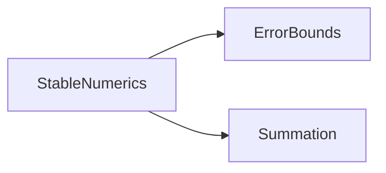

# Iteration 0の解説：浮動小数点数と総和

演習の手順と同じ番号で，各手順の模範解答と考え方を説明する．

## 0-1 準備

演習のパッケージは，3つのファイルからなるスタブで始まる．

- `src/StableNumerics.jl`：`ErrorBounds`と`Summation`を`include`し，7つの関数を`export`する．
- `src/ErrorBounds.jl`：`unit_roundoff`，`gamma`，`relative_error`のスタブ．
- `src/Summation.jl`：`two_sum`，`naive_sum`，`compensated_sum`，`sum_condition_number`のスタブ．

スタブは正しいシグネチャを持つので，パッケージは読み込める．
呼ぶと`error("…は未実装")`で失敗する．テストを書いてスタブを呼ぶと，このエラーが「まだ実装していない」ことを示す正しいRedになる．

## 0-2 文法と概念

1. ULPは値の大きさに比例する．

   ```julia
   julia> eps(1.0), eps(1e16), eps(1e-300)
   (2.220446049250313e-16, 2.0, 1.6578092e-316)
   ```

2. 1e16の近くの数の間隔は`eps(1e16) = 2.0`なので，1e16 + 1はちょうど1e16と1e16 + 2の中間になる．最近接偶数丸めでは，仮数の最下位ビットが0の方(1e16)に丸められる．

3. 分母は2⁵⁵ = 36028797018963968である．0.1の表現誤差の相対誤差は約5.55 × 10⁻¹⁷で，u ≈ 1.11 × 10⁻¹⁶以下になっている．

   ```julia
   julia> d = Rational{BigInt}(0.1) - 1 // 10
   1//180143985094819840

   julia> Float64(abs(d) / (1 // 10)), 2.0^-53
   (5.551115123125783e-17, 1.1102230246251565e-16)
   ```

4. Σ|xᵢ| = 2 × 10¹⁶ + 1，Σxᵢ = 1なので，κ ≈ 2 × 10¹⁶である．n = 3なので誤差界はγ₂·κ ≈ 2u·κ ≈ 4.44になる．相対誤差の上界が1を超えるので，素朴な総和の結果には正しい桁が1つも保証されない．

5. 1つ目は`0.30000000000000004 == 0.3`で不合格，2つ目は既定の`rtol = √eps`で合格，3つ目は相対誤差の許容値が0に対して意味を持たないので不合格になる．

6. `f([1.0, 2.0])`は`1.0`(`Float64`)を返し，`f([1.0f0, 2.0f0])`は`1.0f0`(`Float32`)を返す．`zero(T)`が要素の型に合わせた0を返すからである．

## 0-3 テストリスト

模範解答は[TESTLIST.md](../TESTLIST.md)にある．
項目を選ぶときに考えたことを説明する．

### 厳密に比べる項目と，許容誤差を使う項目

- 単位丸め(2の冪)，整数の和，丸めの起きない`two_sum`，`[1e16, 1.0, -1e16]`の結果は，結果が厳密に決まるので`==`で比べる．
- `two_sum`の無誤差性は「誤差が0」という主張なので，許容誤差0で比べる．浮動小数点数のままa + bを計算すると丸めが入るので，有理数に直して比べる．
- `naive_sum`と`compensated_sum`の一般のデータに対する結果は，誤差界から決めた許容誤差で比べる．

### 参照解

すべての誤差の検査で，`Rational{BigInt}`で求めた厳密な総和を参照解にする．
`test/helpers.jl`に，`exact_sum`(厳密な総和)と`exact_condition_number`(厳密な条件数)を置く．

### テストデータ

条件数が1のデータだけでは，誤差がκに比例して大きくなる場面を検査できない．
次の5種類のデータを使う．

| データ | 条件数 | ねらい |
| --- | --- | --- |
| 0.1を1000個 | 1 | 丸め誤差が同じ向きに積み重なる |
| 調和級数1/k | 1 | 大きさの違う値を足す |
| 交代級数(−1)ᵏ/k | 約10 | 少しの打ち消し |
| `[1e16, 1.0, -1e16]` | 約2 × 10¹⁶ | 情報落ちと完全な打ち消し |
| 近い値の差 | 約2 × 10¹³ | 多数の大きな値の打ち消し |

### 単体テストと結合テスト

- 単体テストは，`ErrorBounds`と`Summation`の各関数の主張(厳密な値，誤差界，例外)を確かめる．
- 結合テストは，利用者の手順をたどる：公開APIの`sum_condition_number`で条件数を求め，`gamma`と`unit_roundoff`で誤差界を見積もり，実際の誤差がその中に収まることを確かめる．計算で求めた条件数を使う点が，単体テストとの違いである．

## 0-4 設計文書

### design/modules.md



`Summation`の関数は誤差界を計算しないので，`ErrorBounds`を使わない．
`ErrorBounds`を使うのはテストである．テストは図に描かず，図の下の説明に書いた．

### design/error-spec.md

7つの関数すべてに行を書いた．要点は次のとおり．

- `naive_sum`の誤差界γₙ₋₁·κと，`compensated_sum`の誤差界u + γₙ₋₁²·κは厳密な不等式なので，そのまま許容誤差にする．
- `two_sum`は無誤差変換なので，許容誤差は0である．
- `sum_condition_number`は，分子を`naive_sum`(すべて非負なので相対誤差γₙ₋₁以下)，分母を`compensated_sum`(相対誤差β = u + γₙ₋₁²·κ以下)で求め，割り算で1回丸める．相対誤差は(1 + γₙ₋₁)(1 + u)/(1 − β) − 1以下になる．テストでは参照解を`Float64`に丸めるので，さらにuを加える．
- `gamma`の計算は，1 − nuと割り算の2回丸めるので，相対誤差はγ₂以下である．テストでは，同じ式を浮動小数点数で計算した値ではなく，有理数で厳密に求めたγₙと比べる．同じ式で計算した値と比べるテストは，式を書き写しただけで何も確かめない．

### design/adr/0001-compensated-summation.md

Sum2を選び，Kahanの方法，対ごとの総和，有理数による計算と比べた理由を書いた．
「検証」の節には，`two_sum`の無誤差性と，`compensated_sum`の誤差界を検査するテストを挙げた．

## 0-5 テストファーストの実装

### ErrorBounds

最初のテストは`unit_roundoff`である．

```julia
@testset "unit_roundoff" begin
    @test unit_roundoff(Float64) == 2.0^-53
    @test unit_roundoff(Float32) == 2.0f0^-24
end
```

テストファイルを`test/runtests.jl`に登録して実行すると，スタブが例外を投げる．
テストの結果は，不合格(Fail)ではなくエラー(Error)になる．

```text
unit_roundoff: Error During Test at …/test/unit/error_bounds_tests.jl:6
  Test threw exception
  Expression: unit_roundoff(Float64) == 2.0 ^ -53
  unit_roundoffは未実装
```

実装は明白なので，すぐに本物を書く．

```julia
unit_roundoff(::Type{T}) where {T<:AbstractFloat} = eps(T) / 2
```

`gamma`は，有理数で求めたγₙと比べるテストから始める．

```julia
for n in [1, 10, 1000, 2^40]
    nu = n * Rational{BigInt}(u)
    @test relative_error(gamma(n, Float64), nu / (1 - nu)) <= gamma(2, Float64)
end
```

このテストは`relative_error`も使うので，先に`relative_error`の最初の項目(一致すれば0.0)を通しておく．
`relative_error`は，`computed`を有理数に直してから引き算する．

```julia
function relative_error(computed::AbstractFloat, exact::Rational{BigInt})
    if iszero(exact)
        return iszero(computed) ? 0.0 : Inf
    end
    return Float64(abs(Rational{BigInt}(computed) - exact) / abs(exact))
end
```

`gamma`は，nu ≥ 1の場合の例外まで含めて次のようになる．

```julia
function gamma(n::Integer, ::Type{T}) where {T<:AbstractFloat}
    nu = n * unit_roundoff(T)
    nu < 1 || throw(ArgumentError("gamma(n, T)はn*u < 1のときだけ定義される(n = $n)"))
    return nu / (1 - nu)
end
```

### Summation

#### two_sum

最初の項目`two_sum(1.0, 2.0) == (3.0, 0.0)`は，仮実装`return (a + b, zero(T))`で通る．
2つ目の項目`two_sum(1e16, 1.0) == (1e16, 1.0)`で仮実装が通らなくなるので，理論のノートの6回の演算で実装する．

```julia
function two_sum(a::T, b::T) where {T<:AbstractFloat}
    s = a + b
    b_virtual = s - a
    a_virtual = s - b_virtual
    e = (a - a_virtual) + (b - b_virtual)
    return (s, e)
end
```

無誤差性のテストでは，大きさや符号の違う5組について，有理数に直したa + bとs + eを`==`で比べる．

```julia
pairs = [(0.1, 0.2), (1e16, 1.0), (1.0, -1e-17), (-3.5, 1e-300), (2.0^60, -3.0)]
for (a, b) in pairs
    s, e = two_sum(a, b)
    @test s == a + b
    @test Rational{BigInt}(a) + Rational{BigInt}(b) == Rational{BigInt}(s) + Rational{BigInt}(e)
end
```

#### naive_sum

空のベクトルの項目は，仮実装`return zero(T)`で通る．
次の項目`naive_sum([1.0, 2.0, 3.0]) == 6.0`を加えると，仮実装は期待どおり不合格(Fail)になる．

```text
naive_sum: Test Failed at …/test/unit/summation_tests.jl:24
  Expression: naive_sum([1.0, 2.0, 3.0]) == 6.0
   Evaluated: 0.0 == 6.0
```

先頭から順に足す実装で，残りの項目(情報落ち，誤差界)も通る．

```julia
function naive_sum(xs::AbstractVector{T}) where {T<:AbstractFloat}
    s = zero(T)
    for x in xs
        s += x
    end
    return s
end
```

誤差界の検査では，データごとに許容誤差を計算する．

```julia
for (name, xs) in SUM_DATASETS
    bound = gamma(length(xs) - 1, Float64) * exact_condition_number(xs)
    @test relative_error(naive_sum(xs), exact_sum(xs)) <= bound
end
```

#### compensated_sum

空のベクトルの項目は`naive_sum`と同じく`zero(T)`で通る．
`compensated_sum([1e16, 1.0, -1e16]) == 1.0`が，補償付き総和の本質を確かめる項目である．
Kahanの方法(補正をすぐ次の加数に足し込む)で実装すると，この項目と，同じデータの誤差界の項目が不合格になる．

```text
compensated_sum: Test Failed at …/test/unit/summation_tests.jl:37
  Expression: compensated_sum([1.0e16, 1.0, -1.0e16]) == 1.0
   Evaluated: 0.0 == 1.0
```

Sum2は，`two_sum`で取り出した誤差を和とは別の変数に集める．

```julia
function compensated_sum(xs::AbstractVector{T}) where {T<:AbstractFloat}
    s = zero(T)
    c = zero(T)
    for x in xs
        s, e = two_sum(s, x)
        c += e
    end
    return s + c
end
```

#### sum_condition_number

`sum_condition_number([1.0, 2.0, 3.0]) == 1.0`は仮実装`return one(T)`で通り，`[1e16, 1.0, -1e16]`の項目で一般化を迫られる．
分母の総和に`naive_sum`を使うと，`[1e16, 1.0, -1e16]`では分母が0になり，`Inf`を返してしまう．
分母には，条件数の大きいデータでも正確な`compensated_sum`を使う．

```julia
function sum_condition_number(xs::AbstractVector{T}) where {T<:AbstractFloat}
    total = compensated_sum(xs)
    iszero(total) && return T(Inf)
    return naive_sum(map(abs, xs)) / abs(total)
end
```

許容誤差は，誤差仕様書のとおりに組み立てる．

```julia
g = gamma(length(xs) - 1, Float64)
κ = exact_condition_number(xs)
β = u + g^2 * κ
tolerance = (1 + g) * (1 + u) / (1 - β) - 1 + u
@test sum_condition_number(xs) ≈ κ rtol = tolerance
```

### 結合テスト

`test/integration/summation_accuracy_tests.jl`では，公開APIだけを使う．
条件数は`sum_condition_number`で計算した値を使うので，その計算誤差の分だけ余裕が要る．
γₙ₋₁の代わりにγₙを使うと，相対1/n程度の余裕が生まれる．条件数の計算誤差(相対10⁻¹³程度以下)はこれよりずっと小さい．

```julia
for (name, xs) in SUM_DATASETS
    n = length(xs)
    κ = sum_condition_number(xs)
    exact = exact_sum(xs)
    @test relative_error(naive_sum(xs), exact) <= gamma(n, Float64) * κ
    @test relative_error(compensated_sum(xs), exact) <= u + gamma(n, Float64)^2 * κ
end
```

## 0-6 振り返り

1. 模範解答のリストには，`gamma`を有理数の値と比べる項目，`relative_error`の0の扱い，`two_sum`の5組の検査，条件数の異なる5種類のデータが含まれている．条件数の大きいデータは，Kahanの方法や補償の足し忘れのように「条件数が1のデータでは正しく見える」間違いを見つける．
2. `return s`に書き換えると，模範解答では60件中14件が不合格になる．`compensated_sum`の`[1e16, 1.0, -1e16]`と`fill(0.1, 10)`の項目，5種類すべてのデータの誤差界の項目，`sum_condition_number`の3項目，結合テストの4項目である．`rtol = 1e-8`で比べるテストなら，条件数が1と10の3種類のデータで合格してしまう．補償をやめた実装は素朴な総和と同じで，その誤差(10⁻¹⁴程度)は`1e-8`よりずっと小さいからである．
3. 条件数が1のデータでは，素朴な総和の誤差もγₙ₋₁程度に収まる．補償付き総和として素朴な総和を返す実装や，Kahanの方法も見逃される．
4. 単体テストは，各関数の主張を，厳密な条件数を使って確かめる．結合テストは，公開APIをつないだ使い方(計算した条件数から誤差を見積もる)が成り立つことを確かめる．結合テストがなければ，`export`の漏れや，`sum_condition_number`の誤差が見積もりを狂わせる問題を見逃す．
5. 誤差界による許容誤差は，理論的な根拠があり，どんな入力でも正しい実装を不合格にしない．一方で最悪の場合の値なので，実際の誤差より数桁大きいことがあり，誤差を少しだけ増やす間違いは見逃す．「実際の誤差の10倍」は，小さな間違いも見つけやすいが，データや計算機が変わると正しい実装が不合格になりうるうえ，根拠を説明できない．このコースでは誤差界を基本にし，見逃しは条件数の大きいデータと厳密に比べられる項目で補う．
6. 模範解答では，設計文書と実装は一致している．`mise run design iterations/iteration-0/solution`で確かめられる．

## 0-7 発展課題

対ごとの総和の解答例を示す．
`÷`は整数の割り算(切り捨て)である．

```julia
function pairwise_sum(xs::AbstractVector{T}) where {T<:AbstractFloat}
    return pairwise_sum(xs, 1, length(xs))
end

# xs[lo]からxs[hi]までの和を，半分に分けて再帰的に求める．
function pairwise_sum(xs::AbstractVector{T}, lo::Integer, hi::Integer) where {T<:AbstractFloat}
    hi < lo && return zero(T)
    lo == hi && return xs[lo]
    mid = (lo + hi) ÷ 2
    return pairwise_sum(xs, lo, mid) + pairwise_sum(xs, mid + 1, hi)
end
```

テストでは，誤差界γ⌈log₂n⌉·κを許容誤差にする(⌈log₂n⌉は`ceil(Int, log2(n))`で求まる)．
誤差仕様書には`pairwise_sum`の行を加え，ADR 0001の比較に，実装して測った誤差を書き加える．
