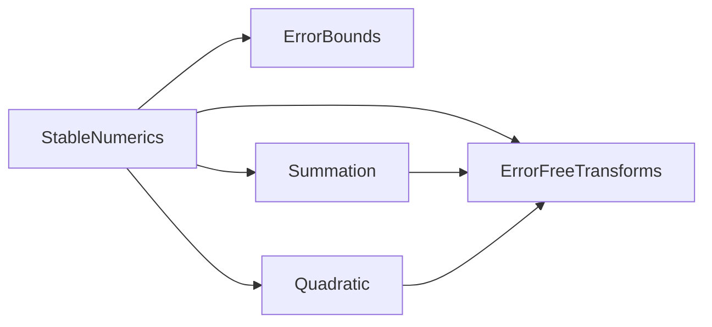

# モジュール依存図

`StableNumerics`を構成するモジュールと，その依存関係を示す．
矢印`A --> B`は，`A`が`B`の関数を使うことを表す．

- `StableNumerics`は，各モジュールの関数を公開する．`StableNumerics`自身は計算をしない．
- `ErrorBounds`は，誤差解析の定数(単位丸めu，γₙ)と，誤差の測り方(有理数または`BigFloat`の参照解に対する相対誤差)を受け持つ．
- `ErrorFreeTransforms`は，和と積の無誤差変換(`two_sum`，`two_prod`)を受け持つ．
- `Summation`は，総和の計算と総和の条件数を受け持つ．補償付き総和で`two_sum`を使う．
- `Quadratic`は，二次方程式の判別式と実根，根の後退誤差と条件数を受け持つ．判別式の計算で`two_prod`を使う．
- テストは，`ErrorBounds`の関数で許容誤差と実際の誤差を求める．
