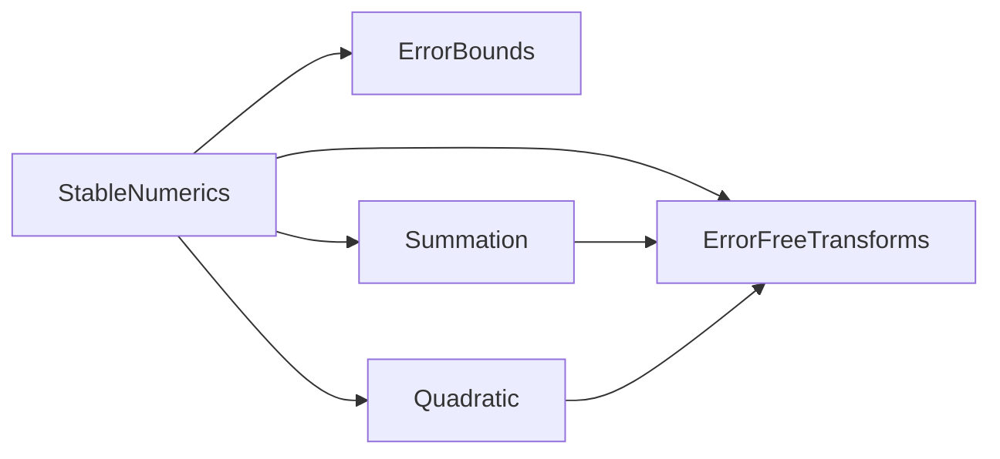

# Iteration 1の解説：二次方程式と後退誤差

演習の手順と同じ番号で，各手順の模範解答と考え方を説明する．

## 1-1 準備

演習のパッケージは，Iteration 0の模範解答と同じコード，テスト，設計文書から始まる．
60件のテストがすべて通り，設計文書の検査も通る状態が出発点である．

## 1-2 文法と概念

1. 公式どおりの小さい根は−7.450580596923828e-9で，`quadratic_roots`が返す−1.0e-8との相対誤差は約25%である．

   ```julia
   julia> x = (-1e8 + sqrt(1e16 - 4)) / 2
   -7.450580596923828e-9

   julia> relative_error(x, quadratic_roots(1.0, 1e8, 1.0)[2] |> big)
   0.2549419403076172
   ```

   `x |> f`は`f(x)`と同じ意味である．

2. 浮動小数点数で計算した判別式は0.0，厳密な判別式は121/16である．b²と4acがどちらも丸められ，その差が打ち消しで拡大された．

   ```julia
   julia> b^2 - 4a * c, Rational{BigInt}(b)^2 - 4 * Rational{BigInt}(a) * Rational{BigInt}(c)
   (0.0, 121//16)
   ```

3. 積の無誤差変換が成り立つ．

   ```julia
   julia> p = 0.1 * 0.1; e = fma(0.1, 0.1, -p)
   -8.326672684688674e-19

   julia> Rational{BigInt}(0.1)^2 == Rational{BigInt}(p) + Rational{BigInt}(e)
   true
   ```

4. 64ビットでは約20桁，256ビットでは約77桁が表示される．精度pビットは，10進でおよそp·log₁₀2 ≈ 0.3p桁である．

   ```julia
   julia> setprecision(BigFloat, 64) do
              sqrt(BigFloat(2))
          end
   1.41421356237309504876
   ```

5. 例えば`kind(x::Integer, y::Integer) = "整数どうし"`と`kind(x::Real, y::Real) = "実数"`を定義すると，`kind(1, 2)`と`kind(1, 2.0)`で違うメソッドが選ばれる．

6. r = 1では，p(1) = 0なので後退誤差は0，条件数は(1 + 3 + 2)/|1 × (2 − 3)| = 6である．r = 1.5では，p(1.5) = −0.25，|a|r² + |b||r| + |c| = 8.75なので後退誤差は1/35である．p′(1.5) = 0なので条件数は無限大である．r = 1.5は根ではなく，放物線の頂点である．

   ```julia
   julia> root_backward_error(1.0, -3.0, 2.0, 1.5), root_condition_number(1.0, -3.0, 2.0, 1.5)
   (0.02857142857142857, Inf)
   ```

## 1-3 テストリスト

模範解答は[TESTLIST.md](../TESTLIST.md)にある．
項目を選ぶときに考えたことを説明する．

### 既存のテストへの影響

`two_sum`は`ErrorFreeTransforms`へ移るので，そのテストも`test/unit/error_free_transforms_tests.jl`へ移す．
テストはモジュール(機能)に属し，モジュールが移ればテストも移る．
`Summation`のほかの項目は，期待値を変えずにそのまま通ることを確かめる．

### 参照解

- 判別式は有理数で厳密に求める．`discriminant`の誤差はこれと比べる．
- 根は，厳密な判別式を256ビットの`BigFloat`に変換し，根の公式で計算する．
- 参照解の精度そのものもテストする．256ビットと512ビットで計算した参照解の相対差がu²以下なら，参照解の誤差は許容誤差γ₆よりずっと小さい．

### 前進誤差と後退誤差

- 判別式をfmaで正確に計算するので，根の前進誤差は条件数によらずγ₆以下である(誤差仕様書)．これを参照解で検査する．
- 後退誤差γ₁₂以下も検査する．後退誤差のテストは参照解を使わないので，結合テストでも使える．
- 条件数の大きい係数(根が近い係数)を必ず含める．条件数の小さい係数だけでは，判別式の扱いの間違いを見逃す．

### 性質

解と係数の関係は，参照解を使わずに検査できる．許容誤差は，各根の相対誤差γ₆から導く(誤差仕様書)．

### 特殊値と境界

a = 0，係数の`Inf`・`-Inf`・`NaN`(3つの係数のそれぞれ)，b = −0.0，重根，根が0の重根，判別式がわずかに負(−4·2⁻⁵²)の場合を入れる．
係数を丸めた結果，厳密な判別式が負になる場合(δ = 10⁻⁸)も入れ，実根の有無の判定が厳密な判別式の符号と一致することを確かめる．

## 1-4 設計文書

### design/modules.md



`two_sum`を`ErrorFreeTransforms`へ移したことで，`Summation`から`ErrorFreeTransforms`への矢印ができた．
`Quadratic`は判別式の計算で`two_prod`を使う．
無誤差変換を1つのモジュールにまとめたので，総和と二次方程式が同じ部品を共有していることが図から読み取れる．

### design/error-spec.md

追加・変更した行は次のとおりである．

- `two_sum`の検証するテストを`test/unit/error_free_transforms_tests.jl`に変えた．
- `two_prod`：無誤差変換なので許容誤差は0である．
- `discriminant`：条件数κ_d = (b² + 4|ac|)/|b² − 4ac|は大きくなりうるが，Kahanの方法の誤差は2 ulp以内なので，相対誤差はγ₄以下である．
- `quadratic_roots`：各根の相対誤差γ₆以下と，後退誤差γ₁₂以下を書いた．導き方は表の下の節に，段階ごとの相対誤差を積み上げて書いた．
- `root_backward_error`，`root_condition_number`：有理数で厳密に計算するので，誤差は最後の丸めだけである．
- `relative_error`：`BigFloat`のメソッドを加えた．

「許容誤差の決め方」に，解と係数の関係の不等式と，参照解の精度の確かめ方を加えた．

### design/adr/0002-stable-quadratic-formula.md

根の公式の書き換えと，Kahanの方法による判別式を選んだ．
判別式を素朴に計算する候補については，後退誤差は小さいが前進誤差が根の条件数に比例することを，Kahanの例の数値(κ_r ≈ 1.4 × 10⁸，相対誤差約1.4 × 10⁻⁸)とともに書いた．

## 1-5 テストファーストの実装

### リファクタリング：two_sumを移す

`two_sum`のテストを`test/unit/error_free_transforms_tests.jl`へ移して実行すると，モジュールがないことでエラーになる．

```text
unit: Error During Test at …/test/runtests.jl:11
  Got exception outside of a @test
  LoadError: UndefVarError: `ErrorFreeTransforms` not defined in `StableNumerics`
```

`src/ErrorFreeTransforms.jl`を作って`two_sum`を移し，`Summation`の先頭に`using ..ErrorFreeTransforms: two_sum`を書く．
`two_prod`のテストを加える前の時点で，テストの件数がリファクタリングの前と同じで，すべて通ることを確かめる．

### ErrorFreeTransforms

`two_prod(3.0, 0.5) == (1.5, 0.0)`は仮実装`return (a * b, zero(T))`で通り，`two_prod(0.1, 0.1)`の項目で一般化を迫られる．

```julia
function two_prod(a::T, b::T) where {T<:AbstractFloat}
    p = a * b
    e = fma(a, b, -p)
    return (p, e)
end
```

無誤差性の検査は`two_sum`と同じ形にする．検査に使う組は`test/helpers.jl`の`EFT_PAIRS`にまとめて2つの関数で共有し，積の丸め誤差が出やすい組(1に近い2つの数)を1つ加えた．

### ErrorBounds

`BigFloat`のメソッドのテストを書いて実行すると，メソッドがないことでエラーになる．

```text
relative_error(BigFloat): Error During Test at …/test/unit/error_bounds_tests.jl:34
  Test threw exception
  Expression: relative_error(0.5, big(0.5)) == 0.0
  MethodError: no method matching relative_error(::Float64, ::BigFloat)
```

同じ関数名に，2つ目の引数の型が違うメソッドを加える．

```julia
function relative_error(computed::AbstractFloat, exact::BigFloat)
    if iszero(exact)
        return iszero(computed) ? 0.0 : Inf
    end
    return Float64(abs(BigFloat(computed) - exact) / abs(exact))
end
```

有理数のメソッドとの比較では，どちらも最後に`Float64`へ丸めるので，丸めの差の2u以内で一致すればよい．

### Quadratic

最初にスタブを置いて`Quadratic`のテストを実行すると，`@test_throws`の項目が不合格(Fail)になり，それ以外の項目がエラー(Error)になる．
スタブは`ArgumentError`ではない例外(`error`による`ErrorException`)を投げるからである．

#### discriminant

`discriminant(1.0, -3.0, 2.0) == 1.0`は`b * b - 4a * c`で通る．
Kahanの例を含む誤差界の項目で，素朴な計算は不合格になる．
`two_prod`で積を分解し，打ち消しが大きいときだけ丸め誤差を加える．

```julia
function discriminant(a::T, b::T, c::T) where {T<:AbstractFloat}
    p, p_error = two_prod(b, b)
    q, q_error = two_prod(4a, c)
    d = p - q
    3 * abs(d) >= p + abs(q) && return d
    return d + (p_error - q_error)
end
```

4aは2の冪を掛けるだけなので厳密である．

#### quadratic_roots

`(1.0, -3.0, 2.0)`の項目は，公式どおりの実装でも通る．
`(1.0, 1e8, 1.0)`を含む誤差界の項目で，公式どおりの実装は不合格になる．
桁落ちしない形に書き換え，例外と特殊な場合を加えると次のようになる．

```julia
function quadratic_roots(a::T, b::T, c::T) where {T<:AbstractFloat}
    iszero(a) && throw(ArgumentError("aが0の方程式は二次方程式ではない"))
    (isfinite(a) && isfinite(b) && isfinite(c)) || throw(ArgumentError("係数は有限でなければならない"))
    d = discriminant(a, b, c)
    d < 0 && return nothing
    q = -(b + copysign(sqrt(d), b)) / 2
    iszero(q) && return (zero(T), zero(T))
    return minmax(q / a, c / q)
end
```

q = 0となるのは，b = 0かつd = 0，つまりc = 0のときだけである．このときc/qは0/0で`NaN`になるので，先に0の重根を返す．

#### root_backward_errorとroot_condition_number

どちらも有理数で計算する．

```julia
function root_backward_error(a::T, b::T, c::T, r::T) where {T<:AbstractFloat}
    A, B, C, R = Rational{BigInt}.((a, b, c, r))
    scale = abs(A) * R^2 + abs(B) * abs(R) + abs(C)
    iszero(scale) && return 0.0
    return Float64(abs(A * R^2 + B * R + C) / scale)
end
```

`root_condition_number`は，分母|r·p′(r)|が0のとき`Inf`を返す．
条件数が根の近さとともに大きくなる項目は，δ = 10⁻⁴，10⁻⁷，10⁻¹⁰の係数で確かめる．

### 間違った実装を見つけられるか

模範解答のテストが，よくある間違いを見つけることを確かめた．

| 間違い | 不合格になったテスト |
| --- | --- |
| 判別式を素朴に計算する(`return d`) | 判別式の誤差界，根の誤差界，実根の有無の判定 |
| 根を公式どおりに計算する | 根の誤差界，解と係数の関係，後退誤差 |

判別式を素朴に計算した実装では，後退誤差のテストと解と係数の関係はすべて通った．
この実装は後退安定で，前進誤差だけが条件数に比例して大きくなるからである．
前進誤差の保証を確かめるには，参照解と比べるテストが要る．

### 結合テスト

`test/integration/quadratic_quality_tests.jl`では，公開APIだけを使う．

- 参照解なしで確かめられること：すべての根の後退誤差がγ₁₂以下である．
- Kahanの例：条件数から見積もった前進誤差κ_r·uはγ₆より大きいが，実際の相対誤差はγ₆以下に収まる．判別式を正確に計算する効果を，条件数と比べて確かめる．

## 1-6 振り返り

1. 模範解答のリストには，参照解の精度の検査，判別式がわずかに負の場合，係数を丸めた結果として実根がなくなる場合を含めた．どれも，参照解やデータの作り方そのものの誤りを見つける項目である．
2. 判別式の誤差界，根の誤差界，実根の有無の判定が不合格になる．後退誤差のテストは通る．判別式の誤差は根の後退誤差としては小さく(係数をわずかに変えれば説明できる)，根の条件数が大きいときだけ前進誤差として拡大されるからである．
3. 参照解との比較は，根の値そのものの誤り(根の順序の入れ替えも含む)を見つける．解と係数の関係は参照解を使わないので，参照解の作り方の誤りを知る手がかりになる．根の順序の入れ替えは解と係数の関係では見つからず，参照解の作り方の誤りは参照解との比較だけでは見つからない．
4. 64ビットの参照解の誤差は約10⁻¹⁹で，桁落ちで拡大されるとγ₆ ≈ 6.7 × 10⁻¹⁶を超えることがある．正しい実装が不合格になり，原因が実装と参照解のどちらにあるのかを区別できなくなる．精度の検査があれば，参照解の側の問題として先に見つかる．
5. リファクタリングの前後で，テストは60件のまま全部通った．テストがなければ，`two_sum`を移したときに`Summation`の振る舞いが変わっていないことを確かめられない．
6. 単体テストは各関数の誤差界と特殊値を確かめる．結合テストは，利用者が公開APIで根の品質(後退誤差と条件数)を評価する流れを確かめる．
7. 模範解答では，設計文書と実装は一致している．`mise run design iterations/iteration-1/solution`で確かめられる．

## 1-7 発展課題

係数の絶対値の最大値の指数kを`exponent`で求め，`ldexp`で係数を2⁻ᵏ倍してから根を求める解答例を示す．
`ldexp(x, n)`はx·2ⁿを返す．2の冪を掛けるのは，オーバーフローとアンダーフローが起きなければ厳密である．

```julia
function scaled_roots(a::T, b::T, c::T) where {T<:AbstractFloat}
    m = max(abs(a), abs(b), abs(c))
    (iszero(m) || !isfinite(m)) && return quadratic_roots(a, b, c)
    k = exponent(m)
    return quadratic_roots(ldexp(a, -k), ldexp(b, -k), ldexp(c, -k))
end
```

拡大縮小しない`quadratic_roots(1.0, 1e200, 1.0)`は`(-Inf, -0.0)`を返すが，この関数は`(-1.0e200, -1.0e-200)`を返す．
拡大縮小した係数では，4acの計算でアンダーフローの起きる場合がある．誤差仕様書の前提には，アンダーフローの下でも誤差界が保たれる条件を書き加える．
