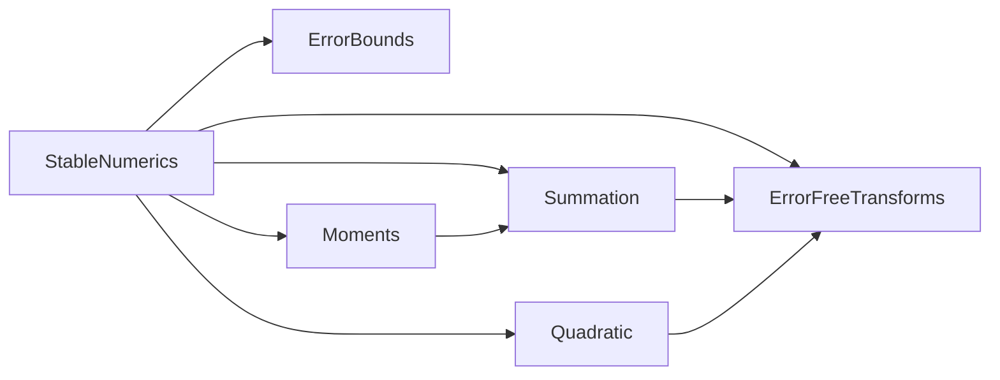

# Iteration 2の解説：分散と性質ベーステスト

演習の手順と同じ番号で，各手順の模範解答と考え方を説明する．

## 2-1 準備

演習のパッケージは，Iteration 1の模範解答と同じコード，テスト，設計文書から始まる．
299件のテストがすべて通り，設計文書の検査も通る状態が出発点である．

## 2-2 文法と概念

1. 同じシードからは同じ乱数が得られる．シードを変えると別の乱数列になる．

2. 教科書の公式で計算した分散は約1.011である(次の出力の`textbook_stats(xs)`)．

3. 10⁸を足したデータでは，次のようになる．

   ```julia
   julia> xs = randn(Xoshiro(1), 1000);

   julia> textbook_stats(xs)
   (0.0318811566747175, 1.0112347343111632)

   julia> textbook_stats(xs .+ 1e8)
   (1.0000000003188115e8, 2.05005005005005)

   julia> variance(xs), variance(xs .+ 1e8)
   (1.0112347343111645, 1.0112347309220113)
   ```

   `textbook_stats`は，ΣxᵢとΣxᵢ²を`for`文で足して平均と分散を返す関数である．
   10⁸を足しても分散は変わらないはずだが，教科書の公式は約2倍の値を返す．
   Welfordの算法の結果も9桁目から変わっている．こちらはアルゴリズムの誤差ではなく，`xs .+ 1e8`の足し算でデータが丸められた(10⁸の近くの数の間隔は約1.5 × 10⁻⁸)ことによる．
   正しい分散そのものが変わったのである．メタモルフィックテストで入力の変換を厳密にする理由がここにある．

4. 約2.1 × 10⁸である．

   ```julia
   julia> v = Rational{BigInt}.(data); S = sum(abs2, v) - sum(v)^2 / 4; sqrt(BigFloat(sum(abs2, v) / S))
   2.108185127860770646172206790373125367694048624115252261926245405708366783419827e+08
   ```

5. 2の冪を掛けるのは厳密で，丸めの位置も一緒に動くので，`0.1 * 2.0^10`は102.4を最も近い倍精度数に丸めた値と一致する．3を掛けると，掛け算で新たに丸めが入る．

   ```julia
   julia> 0.1 * 2.0^10 == 102.4, 0.1 * 3 == 0.3
   (true, false)
   ```

6. 数学的な値は約2 × 10⁻¹⁷だが，1 + 1e-17が1に丸められて0.0になる．許容誤差の式でも同じことが起きる．

   ```julia
   julia> (1 + 1e-17) * (1 + 1e-17) - 1
   0.0
   ```

## 2-3 テストリスト

模範解答は[TESTLIST.md](../TESTLIST.md)にある．
項目を選ぶときに考えたことを説明する．

### 3種類の検査

| 検査 | 参照解 | 例 |
| --- | --- | --- |
| 参照解との比較 | 有理数で求めた厳密な分散 | 相対誤差 ≤ γ₂ₙ·κ_v |
| 厳密に成り立つ性質 | 不要 | 負にならない，定数で0，2ᵏ倍で4ᵏ倍 |
| メタモルフィック関係 | 不要 | 平行移動，並べ替え |

参照解との比較は値の正しさを，性質の検査は誤差の大きさによらない保証を確かめる．
厳密に成り立つ性質は`==`や`>=`で比べられるので，許容誤差を決める必要がない．

### データの作り方

- 平均centerと標準偏差spreadを10の冪から乱数で選び，条件数を1から10⁸まで広げる．
- 要素数も2から200まで乱数で選ぶ．
- 平行移動の検査では，整数値のデータに2の冪を足す．足し算が厳密なので，正しい分散は変わらない．
- 教科書の公式の誤差界の検査では，条件数を10⁴までに抑える．κ_v²uが1を大きく超えると，一次の近似の誤差界が意味を持たない．

### シード

シードは`SEEDS = 1:50`として`test/helpers.jl`に置き，性質ベーステストで共有する．
`@testset`の名前にシードを入れるので，失敗したときにどのシードのデータかが分かる．

### 教科書の公式

`textbook_variance`は比較のための関数だが，誤差界と「負になりうる」ことをテストで記録する．
誤差界のテストは，教科書の公式の誤差が理論どおりκ_v²に比例することの確認にもなる．

## 2-4 設計文書

### design/modules.md



`Moments`は平均の和を`compensated_sum`で求めるので，`Summation`に依存する．
`Random`はテストだけで使うので，図には描かず，説明に書いた．

### design/error-spec.md

- 表の前に，分散の条件数κ_v = ‖x‖₂/√Sの定義を加えた．
- `mean`：補償付き総和の誤差界βと割り算の丸めuから，β + u + βuを導いた．
- `textbook_variance`：一次の近似で(3n + 1)u·κ_v² + 2uを導き，導き方を表の下に書いた．
- `variance`：一次の見積もりnκ_v·uに2倍の余裕を持たせたγ₂ₙ·κ_vを許容誤差とした．見積もりであること，出典，3000組のデータでの実測値(最大0.75nκ_v·u)を書いた．厳密に成り立つ3つの性質とその理由も書いた．
- 「許容誤差の決め方」に，誤差界の式の計算の仕方(1との足し算を避ける)と，メタモルフィック関係の許容誤差(2つの許容誤差の和)を加えた．

### design/adr/0003-welford-variance.md

Welfordの算法を選び，教科書の公式，2回走査する方法，有理数による計算と比べた．
データを1回走査するだけで済み，誤差がκ_vに比例する(2乗ではない)ことを決め手とした．

## 2-5 テストファーストの実装

### テスト専用の依存

`Project.toml`に`Random`を加える前に`using Random`を含むテストを実行すると，テストの環境に`Random`がないことでエラーになる．

```text
ERROR: LoadError: ArgumentError: Package Random not found in current path.
- Run `import Pkg; Pkg.add("Random")` to install the Random package.
```

メッセージは`Pkg.add`を勧めるが，それではパッケージ本体の依存になってしまう．
テストだけで使うので，`[extras]`と`[targets]`に加える．

### mean

`mean([1.0, 2.0, 3.0, 4.0]) == 2.5`は`sum(xs) / length(xs)`でも通る．
`mean([1e16, 1.0, -1e16]) == 1 / 3`と誤差界の項目で，`sum`による実装は不合格になる．

```julia
function mean(xs::AbstractVector{T}) where {T<:AbstractFloat}
    isempty(xs) && throw(ArgumentError("空のデータの平均は定義されない"))
    return compensated_sum(xs) / length(xs)
end
```

誤差界は，浮動小数点数で計算しても0にならない形β + u + βuで書く．

```julia
β = u + gamma(length(xs) - 1, Float64)^2 * exact_condition_number(xs)
@test relative_error(mean(xs), exact) <= β + u + β * u
```

### variance

`variance([1.0, 2.0, 3.0, 4.0]) == 5 / 3`は，教科書の公式でも通る．
`variance([1e9 + 4, 1e9 + 7, 1e9 + 13, 1e9 + 16]) == 30.0`と性質ベーステストで，教科書の公式は不合格になる．

```julia
function variance(xs::AbstractVector{T}) where {T<:AbstractFloat}
    length(xs) < 2 && throw(ArgumentError("分散には2つ以上のデータが必要である"))
    m = zero(T)
    S = zero(T)
    for (k, x) in enumerate(xs)
        d = x - m
        m += d / k
        S += d * (x - m)
    end
    return S / (length(xs) - 1)
end
```

性質ベーステストは，シードごとに`@testset`を作る．

```julia
@testset "variance：厳密な性質 seed = $(seed)" for seed in SEEDS
    rng = Xoshiro(seed)
    n = rand(rng, 2:200)
    xs = shifted_normal_data(rng, n; center = 10.0^rand(rng, 0:8), spread = 10.0^rand(rng, -3:3))
    @test variance(xs) >= 0
    @test variance(fill(xs[1], n)) == 0
    k = rand(rng, -30:30)
    @test variance(xs .* 2.0^k) == variance(xs) * 4.0^k
end
```

メタモルフィック関係では，2つの計算結果の差を2つの許容誤差の和で抑える．

```julia
shifted = xs .+ 2.0^rand(rng, 10:40)
@test abs(variance(shifted) - variance(xs)) <= (tolerance(shifted) + tolerance(xs)) * exact
```

### textbook_varianceとvariance_condition_number

`textbook_variance`は，Σxᵢ²とΣxᵢを1つの`for`文で足して公式に入れる．
`variance_condition_number`は，‖x‖₂²とSを有理数で求め，比の平方根を`BigFloat`で計算する．
`[1.0, -1.0]`では比が1なので結果は厳密に1.0になり，`[1.0, 2.0, 3.0]`では√7を1回丸めた値になる．

### 間違った実装を見つけられるか

| 間違い | 不合格になったテスト |
| --- | --- |
| `variance`を教科書の公式にする | 30.0の項目，負にならない，定数で0，誤差界，平行移動(123件) |
| S/(n − 1)ではなくS/nを返す | 5/3と30.0の項目，誤差界(52件) |
| `mean`を`sum(xs) / length(xs)`にする | 1/3の項目，誤差界(6件) |

教科書の公式に置き換えた実装は，参照解を使わない検査(負にならない，定数で0，平行移動)だけでも見つかる．
S/nを返す間違いは，厳密な性質の検査では見つからない．負にならない，定数で0，4ᵏ倍のどれも，S/nでも成り立つからである．値の正しさは参照解との比較で確かめる．

なお，偏差平方和の増分をd·d·(k − 1)/kと書いても，すべてのテストに合格する．xₖ − mₖ = d·(k − 1)/kなので，これは同じ算法の別の書き方である．

### 結合テスト

`test/integration/variance_accuracy_tests.jl`では，平均が標準偏差の10⁸倍のデータで，利用者が方法を選ぶ流れをたどる．

1. `variance_condition_number`で条件数を求める．
2. 教科書の公式の誤差の上界γ₃ₙ₊₁κ_v²は1を超えるので，正しい桁が保証されない．
3. Welfordの算法の誤差の上界γ₂ₙκ_vは1より小さく，実際の誤差もその中に収まる．
4. 平均の誤差も，総和の条件数1の誤差界の中に収まる．

## 2-6 振り返り

1. 模範解答のリストには，教科書の公式の「壊れ方」(負になる，誤差界)と，`variance_condition_number`の境界(定数のデータで`Inf`)が含まれている．
2. 30.0の項目，負にならない，定数で0，誤差界，平行移動の検査が失敗する(上の表)．参照解を使わない検査だけでも見つかる．
3. 厳密な性質の検査は，負の値や定数での誤差のように，誤差の大きさによらない誤りを見つける．参照解との比較は，値そのものの誤りを見つける．S/nを返す間違いは，参照解との比較(と具体的な値の項目)でしか見つからない．
4. まず，失敗したシードのデータで，相対誤差と見積もりnκ_v·uの比を調べる．比が2に近ければ見積もりの余裕の不足を疑い，比が桁違いに大きければ実装の誤りを疑う．見積もりの余裕を変えるときは，誤差仕様書の根拠も書き直す．
5. 実行するたびにデータが変わるので，失敗が再現しない．たまにしか失敗しないテストは原因を調べられず，やがて無視されるようになる．
6. 単体テストは各関数の誤差界と性質を確かめる．結合テストは，条件数から方法を選ぶという利用者の判断が，実際の誤差と合っていることを確かめる．
7. 模範解答では，設計文書と実装は一致している．`mise run design iterations/iteration-2/solution`で確かめられる．

## 2-7 発展課題

2つの部分の(要素数，平均，偏差平方和)を合わせる解答例を示す．

```julia
function merge_states((na, ma, Sa), (nb, mb, Sb))
    n = na + nb
    δ = mb - ma
    return (n, ma + δ * nb / n, Sa + Sb + δ^2 * na * nb / n)
end
```

引数の`(na, ma, Sa)`は，タプルの引数をその場で分割代入する書き方である．
各部分の(要素数，平均，偏差平方和)をWelfordの算法で求めて合わせると，模範解答のテストデータ(50個のシード，分割位置も乱数)で，つないだデータの分散との相対誤差がγ₂ₙ·κ_v以下に収まった．
誤差仕様書には，この許容誤差が`variance`の見積もりを流用したものであることを書く．
