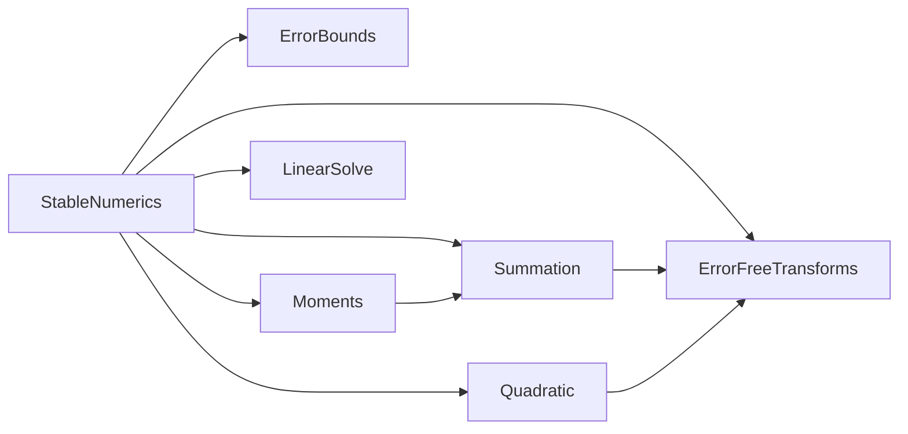

# Iteration 3の解説：連立1次方程式と後退安定性

演習の手順と同じ番号で，各手順の模範解答と考え方を説明する．

## 3-1 準備

演習のパッケージは，Iteration 2の模範解答と同じコード，テスト，設計文書から始まる．
868件のテストがすべて通り，設計文書の検査も通る状態が出発点である．

## 3-2 文法と概念

1. Juliaのノートの`Interval`の例のとおりである．

2. ピボット選択なしでは，乗数l₂₁ = 4/2 = 2，u₂₂ = 3 − 2 × 1 = 1なので，L = `[1 0; 2 1]`，U = `[2 1; 0 1]`である．部分ピボット選択では，1列目の絶対値が大きい2行目をピボットにする．l₂₁ = 2/4 = 0.5，u₂₂ = 1 − 0.5 × 3 = −0.5なので，P = `[0 1; 1 0]`，L = `[1 0; 0.5 1]`，U = `[4 3; 0 -0.5]`である．どの計算も丸めない．

3. `M[[1, 3], :] = M[[3, 1], :]`と書く．

4. 浮動小数点数で計算した`A * [1.0, 1.0] - b`は0になるが，有理数では1行目が約10⁻²⁰になる．1e-20 + 1.0の足し算で，1e-20が丸めで失われるからである．

   ```julia
   julia> Rational{BigInt}.(A) * Rational{BigInt}.([1.0, 1.0]) - Rational{BigInt}.(b)
   2-element Vector{Rational{BigInt}}:
    6646139978924579//664613997892457936451903530140172288
                    0
   ```

   残差を浮動小数点数で計算すると，後退誤差を0と見誤る．

5. 条件数は約3.5 × 10¹³である．`H \ b`と`ones(10)`の差は約8 × 10⁻⁴になる．

   ```julia
   julia> cond(H, Inf)
   3.535432091711151e13

   julia> maximum(abs, H \ (H * ones(10)) .- 1)
   0.0008187325660641287
   ```

   この差には，`H * ones(10)`の丸めで厳密解がずれた分も含まれている．

6. 行ごとの絶対値の和は3と7なので，∞ノルムは7である．

   ```julia
   julia> maximum(sum(abs, [1.0 2.0; 3.0 4.0]; dims = 2)), opnorm([1.0 2.0; 3.0 4.0], Inf)
   (7.0, 7.0)
   ```

## 3-3 テストリスト

模範解答は[TESTLIST.md](../TESTLIST.md)にある．
項目を選ぶときに考えたことを説明する．

### 分解，解，後退誤差を分けて検査する

- 分解：解を求めずに，要素ごとの不等式|PA − L̂Û| ≤ γₙ|L̂||Û|と，乗数の絶対値が1以下であることを確かめる．
- 解：後退誤差をγ₃ₙωと比べ，前進誤差を2κη/(1 − κη)と比べる．
- 補助の関数：`backward_error`と`growth_factor`は，丸めの起きない入力の値を`==`で確かめる．

分解の検査があると，解の誤差界が成り立たないときに，分解と代入のどちらに原因があるかを切り分けられる．

### 参照解は有理数で求める

浮動小数点数の行列とベクトルは有理数の行列とベクトルなので，厳密解(`\`)，逆行列(`inv`)，残差を有理数で厳密に求められる．
前進誤差は「たぶん正しい答え」(`ones(n)`など)ではなく，与えた問題の厳密解と比べる．

### テスト行列

| 行列 | ねらい |
| --- | --- |
| 条件数1〜10¹²の乱数の行列(50個のシード) | 条件数によらず後退誤差が小さいこと，前進誤差が条件数とともに大きくなること |
| ヒルベルト行列(n = 10) | 条件数が10¹³を超えても誤差界が成り立つこと．前進誤差は固定の許容誤差では検査できないこと |
| Wilkinsonの行列(n = 5，10，20) | 増大因子が2ⁿ⁻¹になること |
| `[1e-20 1; 1 1]`，(1, 1)要素の小さい行列 | ピボット選択の有無で結果が大きく変わること |
| `[1 2; 2 4]`，`[0 1; 1 0]` | 特異な行列の例外と，ピボット選択で避けられる0のピボット |

## 3-4 設計文書

### design/modules.md



`LinearSolve`は，このパッケージのほかのモジュールを使わない．
`LinearAlgebra`の`SingularException`を使うことは，図の下の説明に書いた．

### design/error-spec.md

- 表の前に，∞ノルム，κ(A)，M = |L̂||Û|，R = |PA − L̂Û|を定義した．ω，ρ，Rigal–Gachesの後退誤差ηも定義した．
- `lu_factorize`：要素ごとにR ≤ γₙM．
- `solve`：η ≤ γ₃ₙω ≤ γ₃ₙn²ρ，前進誤差 ≤ 2κη/(1 − κη)．
- `backward_error`：有理数で厳密に計算する．
- 表の下に，Wilkinsonの解析による導き方と，残差を浮動小数点数で計算すると後退誤差を小さく見積もる理由を書いた．

### design/adr/0004-partial-pivoting.md

部分ピボット選択を既定にし，完全ピボット選択と比べた．
受け入れ基準を後退誤差にした理由として，ヒルベルト行列では正しい実装でも前進誤差が10⁻⁴程度になることを書いた．

## 3-5 テストファーストの実装

### LinearAlgebraを依存に加える

Pkgモードの`add LinearAlgebra`で，`Project.toml`に`[deps]`と`[compat]`の項目が加わる．

### lu_factorize

`[2 1; 4 3]`の部分ピボット選択の分解が，`LU == [4 3; 0.5 -0.5]`，`perm == [2, 1]`になる項目から始める．
次に`pivot = false`の項目，特異な行列の項目，分解の後退誤差の性質ベーステストを加える．

```julia
function lu_factorize(A::AbstractMatrix{T}; pivot::Bool = true) where {T<:AbstractFloat}
    n = size(A, 1)
    size(A, 2) == n || throw(DimensionMismatch("LU分解には正方行列が必要である(大きさ$(size(A)))"))
    LU = Matrix{T}(A)
    perm = collect(1:n)
    for k in 1:n
        if pivot
            p = k - 1 + argmax(abs.(LU[k:n, k]))
            if p != k
                LU[[k, p], :] = LU[[p, k], :]
                perm[[k, p]] = perm[[p, k]]
            end
        end
        iszero(LU[k, k]) && throw(SingularException(k))
        for i in k+1:n
            LU[i, k] /= LU[k, k]
            for j in k+1:n
                LU[i, j] -= LU[i, k] * LU[k, j]
            end
        end
    end
    return LUFactorization(LU, perm)
end
```

`LU[k:n, k]`の`argmax`は1から始まる位置を返すので，`k - 1`を足して行の番号にする．

### solve

`[2 1; 4 3]x = [3, 7]`の解が`[1.0, 1.0]`になる項目から始める．
前進代入ではLの対角を1として扱い，後退代入ではUの対角で割る．
誤差界の性質ベーステストでは，後退誤差と前進誤差の両方を確かめる．

```julia
η = backward_error(A, x, b)
@test η <= lu_backward_error_bound(F, A)
κ = exact_matrix_condition_number(A)
@test forward_error(x, A, b) <= 2κ * η / (1 - κ * η)
```

### backward_error

最初は，`[1e-20 1; 1 1]x = [1, 2]`の解`[1.0, 1.0]`の後退誤差を0.0と予想してテストを書いた．
残差を有理数で計算する実装では，このテストは次のように不合格になる．

```text
backward_error: Test Failed at …/test/unit/linear_solve_tests.jl:81
  Expression: backward_error(A, [1.0, 1.0], b) == 0.0
   Evaluated: 2.5e-21 == 0.0
```

不合格の原因は実装ではなく，期待値の誤りである．(1, 1)は厳密解ではなく，厳密な残差は(−10⁻²⁰, 0)である．
期待値を10⁻²⁰/4(‖A‖∞‖x‖∞ + ‖b‖∞ = 4)に直した．
浮動小数点数で残差を計算する実装なら，このテストは0.0で合格し，誤りに気づかなかった．

### growth_factor

`[2 1; 4 3]`で1.0，ピボット選択なしの`[1e-20 1; 1 1]`で10²⁰，Wilkinsonの行列で2ⁿ⁻¹になる項目を書く．
Uの要素は`F.LU`の対角とその右上なので，`maximum(abs(F.LU[i, j]) for i in 1:n for j in i:n)`で最大値を求める．

### 間違った実装を見つけられるか

| 間違い | 不合格になったテスト |
| --- | --- |
| 既定を`pivot = false`にする | 分解の値，乗数の絶対値が1以下(47件)，`[1e-20 1; 1 1]`の解，増大因子，結合テスト |
| ピボットの選択で`abs`を忘れる | 乗数の絶対値が1以下(44件)，結合テスト(3件) |
| 残差を浮動小数点数で計算する | 10⁻²⁰/4の項目，前進誤差の誤差界(6件) |

ピボット選択なしでも，後退誤差の誤差界γ₃ₙωのテストは通った．ωは分解の結果から計算するので，増大因子が大きくなれば上界も大きくなるからである．
ピボット選択の誤りは，乗数の絶対値の検査と，ピボット選択ありの上界n²ρと比べる結合テストで見つかる．

### 結合テスト

`test/integration/pivoting_tests.jl`では，(1, 1)要素を10⁻¹²倍した乱数の行列で，利用者がピボット選択の有無を比べる流れをたどる．

1. 部分ピボット選択の増大因子ρから，公開APIだけで後退誤差の上界γ₃ₙn²ρを見積もる．
2. 部分ピボット選択の解の後退誤差は，その上界以下である．
3. ピボット選択なしでは増大因子が大きくなり，後退誤差は上界を超える．

## 3-6 振り返り

1. 模範解答のリストには，分解だけの検査，乗数の絶対値の検査，厳密解ではない解の後退誤差の項目が含まれている．
2. 分解の値，乗数の絶対値，`[1e-20 1; 1 1]`の解，増大因子，結合テストが失敗する．後退誤差の誤差界γ₃ₙωのテストは通る．ωは分解の結果から計算する事後の量で，増大因子が大きくなると上界も大きくなるからである．アルゴリズムが後退安定かどうかは，ωやρが小さく保たれるかどうかで決まる．
3. 10⁻²⁰/4の項目と，前進誤差の誤差界の一部が失敗する．浮動小数点数の残差は残差そのものの誤差を含むので，後退誤差を小さく見積もり，前進誤差の上界2κη/(1 − κη)が実際の誤差より小さくなる．
4. 正しい実装が不合格になる．ヒルベルト行列の前進誤差はγ₃ₙの10¹⁰倍以上である．許容誤差を緩めて通すと，その値に根拠がなくなり，条件の良い行列で起きた誤りも見逃す．許容誤差は，問題ごとに条件数と後退誤差から決める．
5. 単体テストは分解と解の誤差界，補助の関数の値を確かめる．結合テストは，公開APIだけで後退誤差の上界を見積もり，ピボット選択の効果を確かめる流れをたどる．
6. 模範解答では，設計文書と実装は一致している．`mise run design iterations/iteration-3/solution`で確かめられる．

## 3-7 発展課題

Dot2で残差を求め，反復改良をする解答例を示す．

```julia
# Ogita–Rump–OishiのDot2：内積を2倍の精度で計算したのと同程度に正確に求める．
function dot2(x::AbstractVector{T}, y::AbstractVector{T}) where {T<:AbstractFloat}
    s, c = zero(T), zero(T)
    for i in eachindex(x, y)
        p, e = two_prod(x[i], y[i])
        s, f = two_sum(s, p)
        c += e + f
    end
    return s + c
end

function refine(F, A, b, x; steps = 3)
    for _ in 1:steps
        r = [dot2([b[i]; -A[i, :]], [1.0; x]) for i in eachindex(b)]
        x = x + solve(F, r)
    end
    return x
end
```

`[b[i]; -A[i, :]]`は，b[i]とAのi行目の符号を変えたものを縦につないだベクトルである．
rᵢ = bᵢ − Σⱼ aᵢⱼxⱼを1つの内積として計算する．

10 × 10のヒルベルト行列では，有理数で求めた厳密解と比べた前進誤差が，反復改良の前の約2.3 × 10⁻⁴から，3回の更新の後に約6.3 × 10⁻¹⁷になった．
κ(A)u < 1なら，正確な残差を使う反復改良で，前進誤差は作業精度の単位丸め程度まで小さくなる．
テストでは，この上界(と，κ(A)u < 1という前提)を誤差仕様書に書いてから許容誤差を決める．
