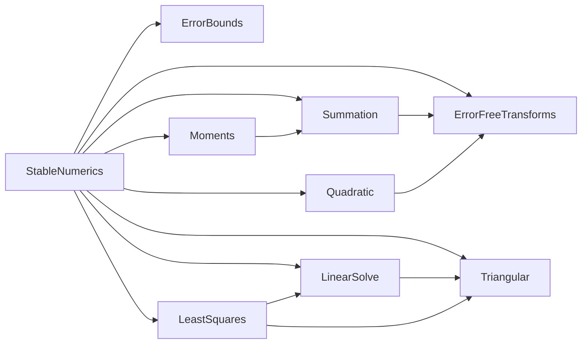

# Iteration 4の解説：最小二乗法と直交変換

演習の手順と同じ番号で，各手順の模範解答と考え方を説明する．

## 4-1 準備

演習のパッケージは，Iteration 3の模範解答と同じコード，テスト，設計文書から始まる．
1242件のテストがすべて通り，設計文書の検査も通る状態が出発点である．

## 4-2 文法と概念

1. Juliaのノートの例のとおりである．`A' * A`はn × nの対称行列になる．

2. 外積`w * v'`は3 × 2の行列で，i行j列はwᵢvⱼである(Juliaのノートの例)．

3. α = −sign(3)·5 = −5なので，v = (x − αe₁)/‖x − αe₁‖₂ = (8, 4)/√80である．

   ```julia
   julia> H = I - 2 * v * v'
   2×2 Matrix{Float64}:
    -0.6  -0.8
    -0.8   0.6

   julia> H * x
   2-element Vector{Float64}:
    -4.999999999999999
     4.440892098500626e-16
   ```

   丸め誤差を除いて(−5, 0)に写る．

4. `cond(V)`は約3.6 × 10⁶，`cond(V' * V)`は約1.3 × 10¹³で，ほぼ2乗になっている．

5. 列どうしが直交し，各列の2ノルムの2乗が4なので，`H' * H`は4Iになる．

   ```julia
   julia> H2 = [1.0 1.0; 1.0 -1.0]; H4 = [H2 H2; H2 -H2]; H4' * H4
   4×4 Matrix{Float64}:
    4.0  0.0  0.0  0.0
    0.0  4.0  0.0  0.0
    0.0  0.0  4.0  0.0
    0.0  0.0  0.0  4.0
   ```

6. LU分解のテストだけが実行される．

   ```text
   Test Summary: | Pass  Total  Time
   LinearSolve   |  224    224  8.1s
   ```

## 4-3 テストリスト

模範解答は[TESTLIST.md](../TESTLIST.md)にある．
項目を選ぶときに考えたことを説明する．

### リファクタリングの扱い

`Triangular`のテストは，`test/unit/triangular_tests.jl`に新しく書く．
`LinearSolve`のテストは変えない．変えずに通ることが，リファクタリングで振る舞いが変わっていないことの保証になる．

### 三角行列の誤差界

前進代入と後退代入は，成分ごとに後退安定である．計算した解x̂は，(T + ΔT)x̂ = b，|ΔT| ≤ γₙ|T|を満たす．
成分ごとの後退誤差maxᵢ|b − Tx̂|ᵢ/(|T||x̂|)ᵢを有理数で計算し，γₙと比べる．
Iteration 3のノルムによる後退誤差より細かい保証である．

### 参照解

| 方法 | 利点 | 欠点 |
| --- | --- | --- |
| 製造解(アダマール行列とパスカル行列) | 答えが構成から厳密にわかる．有理数の計算が要らない．残差の大きい問題も作れる | 行列の形が限られる(行数が2の冪，整数の要素) |
| 有理数で正規方程式を解く | どんな行列にも使える | 計算が遅い |

2つを組み合わせて，構造の違う行列で誤差界を確かめる．

### 定数のわからない誤差界

QR分解の誤差界には，値の示されていない定数cが含まれる．
c = 1とした一次の見積もりに2倍の余裕を持たせたγ₂ₘₙを許容誤差にし，実測の値とともに誤差仕様書に書く．

### 参照解のいらない性質

最適性条件Aᵀr̂ ≈ 0，Q̂の直交性，列ごとの再構成A ≈ Q̂R̂は，参照解なしで検査できる．

### 弱点を狙った入力

ハウスホルダー変換の符号を誤ると，列がe₁にほぼ平行なときだけ桁落ちが起きる．
乱数の行列ではまず起きないので，第1要素が±1，ほかが10⁻⁴〜10⁻¹²の列を持つ行列を加える．

## 4-4 設計文書

### design/modules.md



`Triangular`はLU分解とQR分解の両方から使われる．
`LeastSquares`は，正規方程式を解くために`LinearSolve`のLU分解も使う．

### design/error-spec.md

- 表の前に，成分ごとの後退誤差ω_c，κ₂，ρを定義した．
- `forward_substitution`，`back_substitution`：ω_c ≤ γₙ．
- `householder_qr`，`q_factor`：直交性と再構成の見積もりγ₂ₘₙ．
- `lstsq_qr`，`polyfit`：前進誤差の見積もりγ₂ₘₙ(κ₂ + κ₂²ρ)と最適性条件．
- `lstsq_normal`：前進誤差の見積もりγ₂ₘₙκ₂²．
- 表の下に，Higham(定理19.4，20.3)とWedinの摂動論による導き方と，定数のわからない誤差界の扱い(c = 1，2倍の余裕，実測で最大0.64倍)を書いた．

### design/adr/0005-householder-qr.md

ハウスホルダー変換によるQR分解を選び，正規方程式，グラム・シュミットの直交化，特異値分解と比べた．
αの符号の選び方の理由と，その検証(列がe₁にほぼ平行な行列)も書いた．

## 4-5 テストファーストの実装

### リファクタリング：Triangularを作る

`test/unit/triangular_tests.jl`を登録して実行すると，モジュールがないことでエラーになる．

```text
unit: Error During Test at …/test/runtests.jl:11
  Got exception outside of a @test
  LoadError: UndefVarError: `Triangular` not defined in `StableNumerics`
```

`forward_substitution`は，`unit_diagonal`のときに対角を読まない．

```julia
function forward_substitution(L::AbstractMatrix{T}, b::AbstractVector{T}; unit_diagonal::Bool = false) where {T<:AbstractFloat}
    n = check_sizes(L, b)
    x = Vector{T}(b)
    for i in 1:n
        for j in 1:i-1
            x[i] -= L[i, j] * x[j]
        end
        if !unit_diagonal
            iszero(L[i, i]) && throw(SingularException(i))
            x[i] /= L[i, i]
        end
    end
    return x
end
```

`LinearSolve.solve`は，LU分解の結果をそのまま2つの関数に渡す．

```julia
y = forward_substitution(F.LU, b[F.perm]; unit_diagonal = true)
return back_substitution(F.LU, y)
```

書き換えた後，`LinearSolve`の224件を含む1350件のテストがすべて通ることを確かめた．

### householder_qr

最初の項目(Rの大きさ，`ArgumentError`)の後，直交性と再構成の性質ベーステストを加える．

```julia
function householder_qr(A::AbstractMatrix{T}) where {T<:AbstractFloat}
    m, n = size(A)
    m >= n || throw(ArgumentError("行数が列数より少ない行列はQR分解で扱わない(大きさ$(size(A)))"))
    R = Matrix{T}(A)
    V = zeros(T, m, n)
    for k in 1:n
        x = R[k:m, k]
        α = -copysign(norm(x), x[1])
        v = x
        v[1] -= α
        length_v = norm(v)
        iszero(length_v) && continue
        v ./= length_v
        R[k:m, k:n] .-= 2 .* v .* (v' * R[k:m, k:n])
        V[k:m, k] = v
    end
    return QRFactorization(V, triu(R[1:n, :]))
end
```

`x = R[k:m, k]`はコピーなので，`v = x`を書き換えてもRは変わらない．
k段目の変換の後，k列目のk + 1行目より下は丸め誤差の分だけ0からずれるので，最後に`triu`で0にする．

### lstsq_qr，lstsq_normal，polyfit

製造解のテストでは，まず製造した残差がAの列と厳密に直交することを確かめる．
これはテストデータの検査で，`lstsq_qr`の実装の前から合格する．

```julia
A, x, b, r = manufactured_least_squares(rng, m, n)
@test transpose(A) * r == zeros(n)
@test norm(lstsq_qr(A, b) - x) / norm(x) <= least_squares_tolerance(A, x, r)
```

`lstsq_qr`は，Qᵀbを求めてから後退代入をする．
`lstsq_normal`は，`lu_factorize(A' * A)`と`solve`で正規方程式を解く．
`polyfit`は，ヴァンデルモンド行列を作って`lstsq_qr`を呼ぶ．

### 間違った実装を見つけられるか

| 間違い | 不合格になったテスト |
| --- | --- |
| ハウスホルダー変換の係数2を忘れる | 再構成，最適性，製造解，参照解，`polyfit`(単体テスト205件)，結合テスト |
| `lstsq_qr`を正規方程式で解く | 参照解との比較(37件)，`polyfit`，結合テスト |
| αの符号を逆にする | 列がe₁にほぼ平行な行列の再構成(6件) |

αの符号の誤りは，最初は乱数の行列のテストにすべて合格した．
理論から「列がe₁とほぼ平行な場合に桁落ちする」とわかるので，その入力を加えて見つけられるようにした．

### 結合テスト

`test/integration/least_squares_methods_tests.jl`では，50点に9次の多項式を当てはめる．

1. 有理数で厳密な最小二乗解と残差を求め，許容誤差γ₂ₘₙ(κ₂ + κ₂²ρ)を計算する．
2. `polyfit`の前進誤差は許容誤差以下で，結果は`lstsq_qr`と一致する．
3. `lstsq_normal`の前進誤差は許容誤差を超える(κ₂ ≈ 3.6 × 10⁶なので，κ₂²u ≈ 1.4 × 10⁻³)．

## 4-6 振り返り

1. 模範解答のリストには，製造解そのものの検査(残差の直交性)と，列がe₁にほぼ平行な行列が含まれている．
2. 1242件のテストのうち`LinearSolve`の224件を含め，すべてが変わらずに通った．
3. 乱数の行列のテストは失敗しない．列がe₁にほぼ平行な行列を加えると，再構成の検査が失敗する．
4. 製造解は答えが構成から厳密にわかり，計算も速いが，行列の形が限られる．有理数の参照解はどんな行列にも使えるが，遅い．
5. 同じ問題で2つの方法を比べ，「正規方程式は条件数を2乗する」という理論の影響を，利用者の扱うデータで確かめる．許容誤差を超えることを確かめるテストは，その許容誤差が実装の違いを見分けられるだけ厳しいことの確認でもある．
6. 模範解答では，設計文書と実装は一致している．`mise run design iterations/iteration-4/solution`で確かめられる．

## 4-7 発展課題

重み付き最小二乗法の解答例を示す．

```julia
weighted_lstsq(A, b, w) = lstsq_qr(sqrt.(w) .* A, sqrt.(w) .* b)
```

`sqrt.(w) .* A`は，Aのi行目に√wᵢを掛けた行列である．
すべての重みが4なら，各行を2倍するだけなので，QR分解のすべての中間結果が2倍(ハウスホルダーベクトルは同じ)になり，結果は重みなしと厳密に一致する．
重みが3の場合は√3の丸めが入るので，乱数の行列(20 × 4)で約2.2 × 10⁻¹⁶の差が出た．この差は許容誤差の範囲で検査する．
